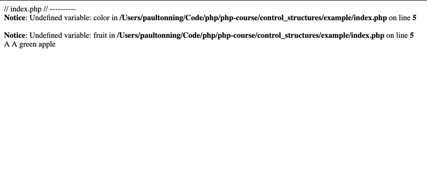

# Example
If you are not running a php server like xampp, you can use the builtin php server.  To use the builtin php server, do the following:
* Open a terminal and navigate to this directory
* In this directory type
```bash
php -S localhost:8888
```
* open a web browser and navigate to http://localhost:8888

* you should see something that looks like the following: 



* Colons can be used to align columns.

| Tables        | Are           | Cool  |
| ------------- |:-------------:| -----:|
| col 3 is      | right-aligned | $1600 |
| col 2 is      | centered      |   $12 |
| zebra stripes | are neat      |    $1 |

There must be at least 3 dashes separating each header cell.
The outer pipes (|) are optional, and you don't need to make the 
raw Markdown line up prettily. You can also use inline Markdown.

Markdown | Less | Pretty
--- | --- | ---
*Still* | `renders` | **nicely**
1 | 2 | 3
